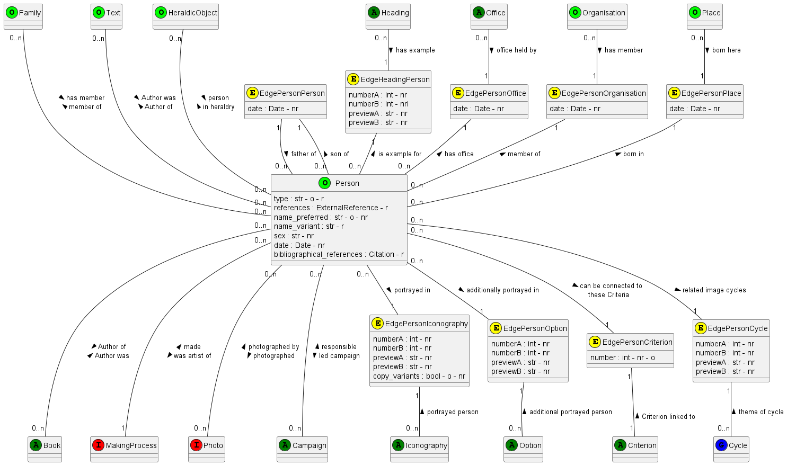
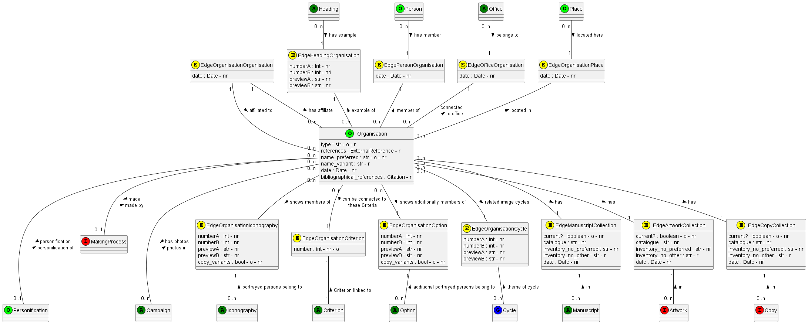

Iconobase - Classes

# Abbreviations

r: repeatable
nr: non-repeatable
o: obligatory

"o" means that the record cannot be saved at all of this field is missing or (for Boolean fields) that they have a default value. 
There will be more criteria for validating records that are ready to be made public. 

# Ancillary classes

In the following, these classes are merely listed like attributes of other classes. I am not sure if they would be connected directly or also with an Edge. With a potential exception in ExternalReference, the Edge would contain no information apart from the IDs of both elements, and the obligatory fields relationA and relationB. 

## Date

This class is used for all indications of dates - all references to "date" as a format refer to it and not to an out-of-the-box date function. 

The field 'active' would be set to 'true' if the start and end dates for a person do not denote the lifespan but rather activity (or attestation in archival records etc.). It is only needed for artists: if an Artwork has no date, it would be dated according to the date of the artist - if the artist's dates are lifespan dates it wold be somthing like start date + 20 years until end date; if they are dates of activity, it would be start date until end date. 

Date_string is the field that is displayed, whilst date_start and date_end are used for filtering. 

All three fields are to be stored, to allow for some flexibility (e.g., if we have an artwork by someone who died in 1599, one might still give as date_string 'late 16th century' but set the date_end to the artist's death). 

date_start and date_end could be in any format for expressing dates (e.g., in some datetime format). However, I had great difficulties with dates BC using Pymongo, and hence simple tuples of integers for year, month, and day seemed to be the savest option. Perhaps this might be easier with Beanie. 

In most cases, the timespan has a start and an end, but there may be also strings with an open end in connecitons between Artworks/Manuscripts and Collection (e.g., "since 1821"). 

If one has an Edge between the Date and the object it is connected to, the relations would be something like "has date" and "date of". 

## ExternalReference

This classe is used for references to external authority files (e.g. GND, GW, Getty ULAN). 

In theory, one could omit the attribute 'URI' and create the URI every time out of a base URI stored somewhere for this type of authority file and the ID, but I am not sure if it is worth it (although it might simplify changes, should the URI syntax for a specific resource change). The other attributes are the name of the resource (for display) and the ID of this object within the resource. 

The attribute 'number' is used for displaying all ExternalReference instances connected to a specific object into a desired order - currently, I only see a reason why someone might want to do so with bibliographical references for books (many early 16th-century books were once regarded as incunables and have hence a GW record - however, the record normally only says something like 'not an incunable, see VD16 instead', and hence the VD16 record would be most useful and should be put first). 

If one has an Edge between the ExternalReference and the object it is connected to, the relations would be something like 'external reference' and "external reference for". In this case, one could put make the number an attribute of the Edge, as is the case with other such numbers. 

## Bibliography

This class will be used for bibliographical references in modern research literature, not for historical books. 
ToDo!

# Authority records

## Person

This record is for any person (Artists, Authors, etc., Depicted figures), hence the great number of possible connections. 

**Attributes:**

- type: 
  - There must be at least a basic type (probably one of the following: "Author", "Printer", "Artist", "Depicted Person").
  - If the type is "Depicted Person", there must be at least one of the following: "Biblical Figure", "Saint", "Historical Figure", "Mythological Figure", "Literary Figure"
  - Possible, there are further necessary types, e.g. for "Saint" "Martyr", "Confessor", "Virgin" etc., or for Mythological Figure "Graeco-Roman", "Egyptian" etc.
  - One Person can have a number of types on every level, and every type determines which attributes and connections will be needed. 

**Edge between Person and Heading:**

This could be used, for instance, for indicating professions. 

**Edge between Person and Text:**

Here, two very different relations are possible. firstly the author of / author of a text as given in the diagram, but also:
Text mentioning figure / mentioned in (for literary figures, e.g. to connect Gulliver to Gulliver's Travels)

**Edge between Person and Book:**

This means the author in the biblical record of a concrete edition of a book, not the author of a text as used in iconographical descriptions. 
In addition to author of / author was, several other relations are possible:
editor of / editor was
printer of / printer was
publisher of / publisher was

**Edge between Person and MakingProcess:**

Note the cardinality, every MakingProcess contains only one Person.

**Edge between Person and Family :**
I am not sure how to use this (it would be helpful for coats-of-arms, but it is a rather vague concept, e.g., do people also belong to the family of the in-laws? what is a family, and what is a branch of a family?). 

**Edge between Person and Office (EdgePersonOffice):**

Offices held by the person. In case of several Offices one would probably sort them chronologically in the UI (or use numberA and mumberB in the Edge)

**Edge between Person and Organisation (EdgePersonOrganisation):**

In addition to has member / member of, many other relations are possible, e.g.:
founded by / founder of
has director / director of (unless 'Office is used for that')
has benefactor / benefactor of
etc. 

**Edge between Person and Place (EdgePersonPlace):**

In addition to born in / place of birth, several other relationships are possible, e.g.:
died in / place of death
active in / place of activity
buried in / place of burial
The date field would be needed for "active in" or similar relationships. 

**Edge between Person and Person (EdgePersonPerson):**

In addition to father of / son of, a great number of other family relations are possible, e.g.
husband of / wife of
etc. etc.

**Edge between Person and Iconography (EdgePersonIconography)**

In addition to portrayed in / portrayed person, other relationships are possible - they depend on the type of iconography selected, e.g.
portrayed in / portrayed person (for portraits)
shown in / acting person (for narrative scenes)
allegory of / connected allegory (for allegorical images)
emblem about / connected emblem (for emblems)
arms of / arms (for heraldry)

The attributes given on the Edge are the standard attributes for everything connected to iconography. Since they go in directions, one could also write them onto the arrows. 

**Edge between Person and Option (EdgePersonOption)**

This works similar to EdgePersonIconography, but it connects not to the 'whole' iconography but only to a variant (e.g., for an additional figure)

**Edge between Person and Criterion**

It is possible to save Criteria not only with Iconographies, but also with Persons (and other records connected to Iconographies, though it will be only really current for Persons and Personifications). If on Iconography is connectedwith this Person, one could link (all or some) criteria of the Person to the specific Iconography. This procedure has been forgotten when I described the creation of Iconographic records in README. !!!!

**Edge between Person and Cycle (EdgePersonCycle)**

This Edge works similar to the Edge between Person and Iconography, but in this case the Person would be the common 'Theme' of a cycle (e.g., "Labours of Hercules"). I have to think more about how to do that (especially, if there should be a node between the Cycle and the Person)

**Additional criteria for creating links:**

- Only Persons with the type "Author" or "Literary Figure" can be linked to Texts. 
- Only Persons with the type "Author" or "Printer" can be linked to Books
- Only Persons with the type "Artist" or "Printer" can be linked to Making Processes ("Printer" only to specific Making Processes). 
- Only Persons with the type "Depicted Person" can be linked to Iconography, Option, Criterion, and Cycle 
 

**Additional criteria for validation for saving record:**

- none
  

**Additional criteria for validation for publishing record:**

- A Person with the type "Historical Person" needs a Date and furthermore must be linked to either an Office or a Profession (Heading) plus a Place. 
- A Person with the type "Depicted Person" needs a sex (can also be unknown)
- A Person with the type "Literary Person" needs a Text. 
- A Person needs to be linked to a Book, a Text (as author etc.), a Making Process, or an Iconography (or Option or Cycle). 

## Organisation 

This record is for two different types of organisations, firstly Collections and secondly what could be called Groups of Members. It may make sense to have here two different types of records, but they also may overlap (e.g., an Abbey may have a library or an art collection) - although one could have different Group of Persons and Collection records and cross-reference them, as one wold cross-reference between an Abbey as Organisation and the Buildings of an Abbey. 

**Attributes:**
- type:
  - There must be at least a type "Collection" or a type "Group of Members" (I hope I find a better name), and there can also be both. 
  - If there is a type "Collection", there must also be a type "Museum", "Library", "Archive" (pershaps), "Private Collection", "Dealer", or "Auction House". These are mutually exclusive, and they determine the way other attributes are displayed in the UI. 
  - The name_variant field would also include former names. Currently, there is no way to indicate the time of name changes, but this is not really the job of Iconobase. 
  
**Edge between Organisation and Heading**
This is not yet really developed, one might want to connect, e.g., all civic militias (which are important in Dutch art, e.g., Rembrandt's Nightwatch to heading such as 'military units')

**Edge between Organisation and Person (EdgePersonOrganisation)**
In addition to has member / member of, many other relations are possible, e.g.:
founded by / founder of
has director / director of (unless 'Office is used for that')
has benefactor / benefactor of
etc. 

**Edge between Organisation and Office (EdgeOfficeOrganisation)**
This is used if a role in an organisation seems to be so prominent that it would be defined as 'Office', a good example might be "Abbot of Aldersbach". I am not yet really sure on how to count the connections. 

**Edge between Organisation and Place (EdgeOganisationPlace)**

In addition to located in / located here, some other relations are possible, e.g.:
owns this building / building of (e.g., for the connection between "Aldersbach Abbey" and the monastic buildings at Aldersbach)

**Edge between Organisation and Organisation (EdgeOrganisationOrganisation)**

This is still a vague idea, it could, for instance, link different organisations together, e.g. "Aldersbach Abbey" and the "Cistercian Order". 

**Edge between Organisation and Iconography (EdgeOrganisationIconography)**

In addition to shows members of / portrayed persons belong to (used for group portraits of members of an organisation), a number of other relations, each for different types of iconography, would be possible, e.g. 
action of members of this organisation / organisation the acting figures belong to (for narrative scenes)
allegory of / organisation shown in this allegory (for allegorical images)
emblem about / organisation alluded to in this emblem (for emblems)
coat of arms of / organisation bearing these arms (for heraldic images)

The attributes given on the Edge are the standard attributes for everything connected to iconography. Since they go in directions, one could also write them onto the arrows. 

**Edge between Organisation and Option (EdgeOrganisationOption)**

This works similar to EdgeOrganisationIconography, but it connects not to the 'whole' iconography but only to a variant (this will be rarey used for Organisations, it is rather here to keep it parallel to Persons)

**Edge between Organisation and Criterion**

This Edge is primarily incuded to have a parallel with an Edge for Persons. 

**Edge between Organisation and Cycle (EdgeOrganisationCycle)**

This Edge works similar to the Edge between Organisation and Iconography, but in this case the Organisation would be the common 'Theme' of a cycle (e.g., "Events from the History of Aldersbach Abbey"). I have to think more about how to do that (especially, if there should be a node between the Cycle and the Organisation)

**Edge between Artwork and Collection (EdgeArtworkCollection)**
**Edge between Manuscript and Collection (EdgeManuscriptCollection)**
**Edge between Copy and Collection (EdgeCopyCollection)**

These three Edges have the same structure. 
- EdgeArtworkCollection is used for Artworks that are neither Multiples (as prints are) nor kept in manuscripts
- EdgeManuscriptCollection is used for complete Manuscripts
- EdgeCopyCollection is used for individual copies of multiples (irrespective if they are single objects, e.g., single-leaf prints, or parts of books)
- 

**Additional criteria for creating links:**

- For EdgeOrganisationPlace, the different relations go only together with specific types of Place, e.g. "located in" only with a Town or a Region, and "owns this building" only with a Building or a Building-Part
- For EdgeOrganisationIconography, the different relations go only together with specific types of iconography. 
- The three links with "Collection" can only be used if the Organisation has "Collection" amongst its types. 
 

**Additional criteria for validation for saving record:**

- The types of the Organisation contain "Collection" plus a type of a collection and/or "Group of Members"
- 

**Additional criteria for validation for publishing record:**

- The Organisation must be connected to another record. 

## Place

A Place can be anything from a country down to a composite object containing several Artworks (e.g., a multi-part altarpiece). Like Text records, places are hierarchically organised, each Place normally being connected to one and only one parent place. 

**Attributes:**
- type: Here, types are mutually exclusive (e.g., Town, Building, etc.), hence type is non-repetible
- coordinates: I suggested here feour different non-repetible attributes - one could also pack them into a separate class. The coordinates are given in two variants in the GND, once as degrees - minutes - seconds, once as decimal fractions. If one still wants to import both, one would need either a separate, repetible, class for the coordinates, or eight non-repetible attributes. The first set would need tuples of integers, the second floats. 
- date: I am not sure if this would be used here, it could be used to indicate when buildings or building-parts existed (will in most cases be open-ended). Other dates would be shown in the Edge

**Edge between Place and Person (EdgePersonPlace):**

In addition to born in / place of birth, several other relationships are possible, e.g.:
died in / place of death
active in / place of activity
buried in / place of burial
The date field would be needed for "active in" or similar relationships. 
 
**Edge between Place and Family (EdgePlaceFamily):**

As most things connected to the class Family, this is still vague. It could be used to connect families with their main places of activity, or perhaps also places of origin. 

**Edge between Place and Office:**

An Office must be connected either to an Organisation (e.g., Abbot of St Gallen Abbey) or to a Place (e.g., King of France). 
In case one would want to record also other connections, e.g., the seat of the office, e.g. Bonn for the Archbishop of Cologne, one might need here a date field in the Edge, but I think this is an overkill. 

**Edge between Organisation and Place (EdgeOganisationPlace):**

This link will be needed in two constellations: 
- Organisations that are groups of members could be connected the Towns or Historical Regions where they were based. 
- Organisations that are collections could be connected to the Towns or Modern regions where they would be found. 
In addition to located in / located here, some other relations are possible, e.g.:
owns this building / building of (e.g., for the connection between "Aldersbach Abbey" and the monastic buildings at Aldersbach). 

**Edge between Place and Place (EdgePlacePlace):**

Every place has to be connected to a parent place (e.g., a building to a town). Naturally, this will not be possible for the top parent (e.g. "Earth" or "Universe", should one allow for extraterrestrial places). In virtually all places, there will be one and only one parent. The only exception would be records of the type 'Town' - they could be connected to one record of the type 'Modern Region' and one or more records of the type 'Historical Region' (e.g., Bonn would be linked to the modern region "Nordrhein-Westfalen", but probably to the Historical Region "Mittelrhein"). The former is used to locations of artworks, the latter for places of origin. In some cases, there might be several Historical Regions, e.g., the "Byzantium" and "Ottoman Empire" for Constantinople. (It might be possible that 'Historical Regions' might also have several other 'Historical Regions' as parents). 

**Edge between Place and Iconography (EdgePlaceIconography):**

There are several relationships possible, depending on the Type of Iconography and the Type of Place, e.g.

for Iconography "Topographical View" and Place "Historical Region": 
view / view of
map / map of

for Iconography "Topographical View" and Place "Town": 
view / view of
plan / plan of

for Iconography "Topographical View" and Place "Building", "Building" or "Building part": 
exterior / exterior of
interior / interior of
reconstruction / reconstruction of
elevation / elevation of
plan / plan of

for Iconography "Narrative Scene" 
action happening here / place of action (Here is a problem: this would only indicate where an action took place, not if the place is really shown there, the latter would be rather under EdgePlaceOption)

**Edge between Place and Option (EdgePlaceOption):**

This is in principle similar to EdgePlaceIconograhy. It will probably be largely used if a building or a building part can feature in a narrative scene or not (e.g., if the Meta Romuli appears in the Crucifixion of St Peter)

**Edge between Place and Criterion:**

This would function in general like the link between Person and Criterion - however, I am not sure if it would really be used. 

**Edge between Place and Cycle (EdgePlaceCycle):**

This Edge works similar to the Edge between Place and Iconography, but in this case the Place would be the common 'Theme' of a cycle (e.g., "Events happened in Florence"). I have to think more about how to do that (especially, if there should be a node between the Cycle and the Place). 

**Edge between Place and Heading:**

I am not sure about how this Edge could be used. Perhaps, one might group differenttypes of buildings or building parts together, e.g. Franciscan Churches, Libraries, or Pulpits. 

**Additional criteria for creating links:**

Most links only make sense with certain types of Place records: 

- Persons / Families / Offices: only types "Historical Region" and "Town"
- Organisations: 
  - for located in: "Historical Region", "Modern Region", and "Town"
  - for owned the building: "Building Group", "Building"
- Places: only the following connections for 'has part' are possible:
  - "Historical Region" : "Historical Region", "Town"
  - "Modern Region" : "Modern Region", "Town"
  - "Town" : "Building", "Building Group", "Composite Artwork" [the latter used e.g. for monuments]
  - "Building Group" : "Building"
  - "Building" : "Building Part", "Composite Artwork"
  - "Building Part" : "Building Part", "Composite Artwork"
  - "Composite Artwork" : "Composite Artwork" (e.g. wings of a large altarpiece)
- MakingProcesses : "Historical Region", "Town"
- Artworks: "Town", "Building Complex", "Building", "Building Part", "Composite Artwork"

**Additional criteria for validation for saving record:**

- none
  

**Additional criteria for validation for publishing record:**

- The Place must be 'part of' a parent place. 
  - If the Place is connected with an Artwork or an Organisation with the type "Collection", it must be connected to a upwards through "Modern Regions". 
  - If it is connected with a Person, a Family, an Office, an Organisation that is not a collection, a Book, an Iconography, an Option, a Criterion, or a MakingProcess, it must be connected upwards through "Historical Regions"
- In addtion, the Place must be connected to at least another node. 

## Book 

This record is for Books that contain printed illustrations - hence, there are probably a number of copies with the same illustration (not for modern bibliographical references). 

**Attributes:** 

parent title and volume number are only to be used for multi-volume works, and I am not sure what to do here. 
It would be the most correct solution to have a separate record for the parent title and to connect it to the individual volumes. However, this methods is probably an overkill here. 
One might even copy everything into one title phrase, I am not sure. 

all_catalogued? would True by default. If for some reason only a part of the images have been entered into the database (e.g., only the big images, not decorative borders with figures), it has to be set to False, and a description of what has and what has not been entered added to the all_catalogued?_comments field. 

I reckon dates will always be non-repeatable (or not???), and I cannot think why one would need two different dates here. (There might be conflicting indications of dates, but they might better go into a comment field)

**Edge between Book and Person:**

In addition to author was / author of, also the following Relations are possible:
editor was / editor of
printer was / printer of
publisher was / publisher of

**Edge between Book and Place:**

In addition to published in / place of publication of, also the following Relation is possible:
printed in / place of printing of

**Manuscript:**

This connection is for the case that a copy of a printed book has painted decorations. In some cases one would simply catalogue it as a 'manuscript', but in other cases one might one to refer to the original book (e.g., if the paintings are actually overpaintings of the printed illustrations and copy their compositions, as not rare in French luxury books). This is not be used very often. 

**Edge between Book and Artwork (EdgeBookArtwork):**

The sequence number is the number of the Artwork within the Book. If there were only one Artwork per page, it could be the canvas number of the IIIF manifest, but if there are several images on a page, it would need a suffix so that the images appear in correct narrative order. This could be a tuple of two integers, a float with the image number on the page after the decimal point, or a string consisting of the canvas number and a letter - but this may be harder for sorting. 
The cardinality from Artwork to the Edge is 0..1 - by definition, a re-impression of an image in a different book is a different Artwork (since other connections from Artworks to Edges denoting Locations would be 0..n, it might be easier to also set 0..n here, too)

**Additional criteria for validation for publishing record:**

- At least one Artwork must be connected to the Book. 
- A connection between Artwork and Book is only possible if the Artwork has a Medium suitable for Books (e.g., "Engraving", "Woodcut"), e.g. not "Mural Painting". Probably, connections to Book objects should only be suggested for Artworks with appropriate Media. 
- 
## Manuscript

This record is a parallel to the 'Book' record, but is for objects that only exist once, thus either manuscripts or copies of printed books with some unique decoration (e.g., painted decoration, binding). Since these items are identified by their location, not by author, title, place and date of printing, the Manuscript records are simpler than the Book records. 

**Attributes**:

- The type could indicate if it is a Manuscript, or unique decoration in a printed book. This is primarily relevant for display purposes, it would be confusing to call a printed book with a painting on the first page a manuscript. Both options are mutually exclusive, hence the attribute is marked as non repetible - however, in other cases, the type would be repetible, and it doesn't harm to have it here as repetible, too. 
- ExternalReference is here primilary for the planned International Standard Manuscript Number. 
- The fields common_name_preferred and common_name_variant will only be used for some very prominent manuscripts that are known not only under the shelfmark (as usual), but also under a name, e.g. "Lindisfarne Gospels"
- all_catalogued? functions as with Books. 

**Edge between Manuscript and Artwork (EdgeManuscriptArtwork):**

This functions similar to the Edge between Book and Artwork (see above). 
New is the attribute "current?" - it indicates if the Artwork is still part of the Manuscript or has been cut out (alas, too common)
The cardinality from Artwork to the Edge is now not 0..1 but 0..n - there are cases of images cut out from one manuscript and glued into another; but I assume that this cardinality would be probably 0..n by default, see above under Book. 

**Edge between Book and Collection (EdgeManuscriptCollection):**

This Edge is the same as the Edge between Artworks and Collections. 

(move the following to there, once I have a diagram for Artwork)
- current indicates whether the Artwork or Manuscript is still deemed to be in the Collection or not. It is by default 'True' if the Collection is a Library, a Museum, or a Private Collection, and 'False' if the Collection is a Dealer or an Auction House. 
- inventory_number_preferred and inventory_number_other (the latter repetible) need different names in the front-end depending on the type of the Collection. 
  - "shelf mark" if the Collection is a Library (or an Archive, if I create this category)
  - "inventory number" if the Collection is a Museum or a Private Collection
  - "lot number" if the Collection is an Auction House
  - "catalogue number" if the Collection is a Dealer (only in this case one would need the field catalogue for the number of the catalogue in a series of catalogues of this dealer). 
- date means different things according to the type of Collection (this must be reflected in the FE, but I am not sure if this would be used for searches)
  - for Archives, Libraries, Museums, and Private Collections it means the time-span the object is or was in this collection (if known)
  - for Auction Houses it means the date of the Auction
  - for Dealers it means the date given in the catalogue. 
  
  It must be possible to have several different Edges between the same Artwork (or Manuscript) and the same Collection (e.g., quite a few manuscripts have been auctioned several times by Sotheby's)

**Additional criteria for creating links:**
- An EdgeManuscriptArtwork can only be established if the Artwork has a Medium appropriate for a Manuscript (e.g. "Illumination", not "Mural Painting")

**Additional criteria for validation for saving record:**

- If there is more than one EdgeManuscriptArtwork, not more than one may have current as True. 
- If there is more than one EdgeManuscriptCollection, not more than one may have current as True. 

**Additional criteria for validation for publishing record:**

- At least one Artwork must be connected to the Manuscript.
- The Manuscript must be connected to at least one Organisation of the type "Collection". 
- If the Collection is a Library or an Archive, there must be an inventory_number_current. 
- If the Collection is an Auction House, there must be a date (or a dummy for date not known??)

